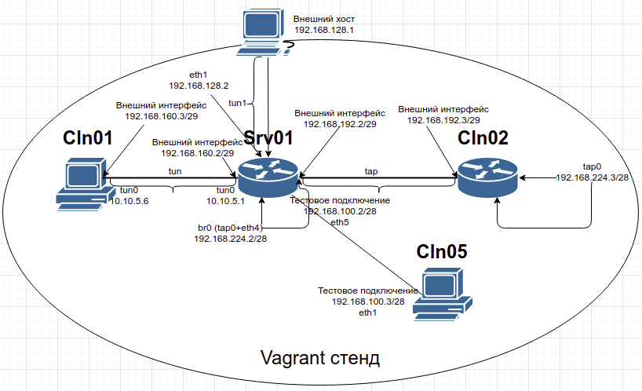

# Мосты, туннели и VPN

## Домашнее задание по теме

Разворачиваем стенд, где openVPN используется для запуска трёх серверов, на одной виртуальной машине srv01:

Для тестирования соединений чрез созданные тунели, будем использовать тестового клиента, **Cln05** 192.168.100.3/28, который подключен со стороны сервера ( openvpn server, eth5 интерфейс), сеть 192.168.100.0/28

___

##### Организация туннель между хостовой машиной и внутренним сервером

В vagrant-e создаём внешнюю сеть "vpn-net_1", 192.168.128.0/29

"внешние" IP адреса для организации туннеля:

      srv01         - 192.168.128.2/29
      "хост машина" - 192.168.128.1/29

На сервере openvpn, 192.168.128.2/29:
- запускается на порту 1194 для возможности подключения через туннель tun с хостовой машины
-  туннель создаётся между srv01 - "хост машина"
    Для организации такого туннеля, в папке проекта находится файл:

    [Файл конфигурации для запуска туннеля, с хостовой системы](./192.168.128.1.conf)  
    Этот файл необходимо поместить в папку /etc/openvpn/client на хостовой системе, и выполнить:

        systemctl start openvpn-client@192.168.128.1

Туннель организовывается на базе сети 10.10.10.1.0/24, где серверу и клиентам выдаются IP адреса, для организации туннельной сети, из этой подсети.

___
##### Организация туннеля типа "tun"

В vagrant-e создаём внутреннюю сеть "vpn-net_2", 192.168.160.0/29

"внешние" IP адреса для организации туннеля:

      srv01 - 192.168.160.2/29
      cln01 - 192.168.160.3/29

На сервере openvpn, 192.168.160.2:
- запускается на порту 1195 для организации туннеля типа tun (сетевой L3 уровень по модели OSI)
- туннель создаётся между srv01 - cln01

Туннель организовывается на базе сети 10.10.10.5.0/24, где серверу и клиентам выдаются IP адреса, для организации туннельной сети, из этой подсети.

Запустим тест
на тестовом слиенте **Cln05**:

      iperf3 -s

на cln01 запустим тест канала:

      iperf3 -c 192.168.100.3 -i 5 -t 60 -b50M -u

___
##### Организация туннеля типа "tap"
В vagrant-e создаём внешнюю сеть "vpn-net_3", 192.168.192.0/29

"внешние" IP адреса для организации туннеля:

      srv01 - 192.168.192.2/29
      cln02 - 192.168.192.3/29

На сервере openvpn, 192.168.192.2:
- запускается на 1196 порту, для организации туннеля типа tap ( канальный L2 уровень по модели OSI)
- туннель создаётся между srv01 - cln02.   

Туннель организовывается на базе сети 192.168.224.0/28
На сервере готовится подключение типа - мост, куда входят физический интерфейс eth4 и создаваемый туннельный интерфейс tap0
где серверу srv01 назначается IP адрес:

      192.168.224.2/28

а клиентским подключениям выдаётся IP из диапазона:

      192.168.224.8 - 192.168.224.14

Запустим тест
на тестовом слиенте **Cln05**::

      iperf3 -s

на cln02 запустим тест канала:

      iperf3 -c 192.168.100.3 -i 5 -t 60 -b50M -u

**Генерация ключей для работы OpenVPN в режиме сертификатов, с  помощью скрипта easy-rsa**

dnf install easyrsa

cd /usr/share/easy-rsa/3

- Очистка всех существующих ключей:
./easyrsa clean-all

- Инициализация PKI инфраструктуры:
./easyrsa init-pki

- Генерация корневого сертификата:
./easyrsa build-ca nopass

- Генерация ключа Диффи-Хеллмана:
./easyrsa gen-dh

- Генерация ta (TLS) ключа:

openvpn --genkey --secret ta.key

- Генерация пары ключ-сертификат для сервера:
./easyrsa build-server-full <serverIP> nopass

- Генерация пары ключ-сертификат для клиента
./easyrsa build-client-full <client1> nopass

- Отзыв ключа:
./easyrsa revoke client1

vars файл для генерации ключей и сертификатов:

      export KEY_COUNTRY="BY"
      export KEY_PROVINCE="Minsk"
      export KEY_CITY="Minsk"
      export KEY_ORG="SYSAD"
      export KEY_EMAIL="test@test.by"
      export KEY_CN="IT"
      export KEY_OU="IT"
      export KEY_NAME="otus"

**В результате генерации ключей получаем следйющие наборы:**
- vpn-net_1:
  - "хост машина":

        192.168.128.1.crt
        192.168.128.1.key

  - "srv01":

        192.168.128.2.crt
        192.168.128.2.key

- vpn-net_2:
  - "srv01":

        192.168.160.2.crt
        192.168.160.2.key

  - "cln01"

        cln01.crt
        cln01.key

- vpn-net_3:
  - "srv01":

        192.168.192.2.crt
        192.168.192.2.key

  - "cln02":

        cln02.crt
        cln02.key

- Корневые сертификаты:

        ca.crt
        ca.key

- ключ Диффи-Хеллмана:

        dh.pem

- (TLS) ключ:

        ta.key

**Файлы конфигурации сервера openvpn и клиентов openvpn нужно положить в папки /etc/openvpv/server и /etc/openvpv/client соответственно. C помощью ansible скопируем необходимые шаблоны на нужные виртуальные машины**

По результатам тестов, тип туннеля "tap", оказался более эффективным. 

#### SELinux

Разрешим работу сервера на нестандартных портах

      semanage port -a -t openvpn_port_t -p udp 1195-1196

___

#   Общая теория, примеры, полезности.

**Маршрутизация**

Т.к. основной задачей сервера является обеспечение доступа удалённых пользователей/серверов к внутренним ресурсам, сервер позволяет определять статическую маршрутизацию от клиентов к серверу и от сервера к клиентам. С точки зрения доступа клиентов к внутренним ресурсам, сервер при помощи протокола DHCP и директив "route" или "push route" позволяет передать клиенту маршруты внутренних сетей. Для оповещения самого сервера об удалённых сетях на стороне клиента используется "client config dir" (ccd), механизм позволяющий описать при помощи директивы "iroute" список внутренних сетей клиента, которые должны попасть в таблицу маршрутизации сервера для транзита в них трафика.

#### Описание команд и основных опций

- **remote < host >** - определяет удаленный конец туннеля. Могут использоваться записи IP и DNS. В режиме tcp-server этот параметр на сервере работает как фильтр и принимает соединения ТОЛЬКО от указанного host.

- **local < host >** - определяет локальный ip или имя хоста, на котором будет работать OpenVPN. Актуально, если на локальной машине несколько адресов.

- **dev < device >** - определяет какой использовать тип устройства tun или tap. Например:

      dev tun
      или
      dev tap

      При одном из таких указаний будет использован свободный интерфейс tun или tap. Так же можно явно указывать номер виртуального интрефейса, например tun0.

- **port < port number >** - указывает на каком порту будет работать OpenVPN (локально и удаленно).

- **proto < proto >** - какой протокол будет использоваться. Возможные значения: udp, tcp, tcp-client, tcp-server.

      tcp-client - сам пытается установить соединение
      tcp-server - только ждет подключений

      Примечательно, что с использованием протокола udp VPN будет работать чуть быстрее, чем tcp. Но в плане стабильности работы лучше выбирать tcp (как показывает практика, VPN-соединение более устойчиво)

- **remote-random** - если указана данная опция и в random перечисленно несколько удаленных хостов, то OpenVPN в случайном порядке будет к ним подключаться. Применяется для балансировки нагрузки.

- **float** - позволяет удаленному хосту изменять IP во время работы туннеля. Соединение при этом не разрывается.

- **ipchange < cmd >** - выполняет скрипт или команду указанную в < cmd >, если IP сменился. Пример:

      ipchange script-ip.sh

- **connect-retry < seconds >** - пробует переподключиться через указанное время в секундах, если соединение было разорвано.

- **connect-retry-max < n >** - максимальное количество повторов если соединение было разорвано

- **resolv-retry < seconds >** - если OpenVPN не удалось узнать имя удаленного хоста по DNS, то через указанное количество секунд попытаться переподключиться.

- **lport < port >** - указывает на локальный порт для использования OpenVPN

- **rport < port >** - аналогично для удаленного порта. Пример:

      rport 8000   - OpenVPN будет пытаться подключится к удаленному порту 8000

- **nobind** - использовать динамический порт для подключения (только для клиента)

- **shaper < bytes >** - указывает скорость передачи данных в байтах для исходящего трафика (только для клиента)

- **tun-mtu < mtu size >** - устанавливает максимальный размер MTU. По умолчанию tun-mtu равен 1500. Использование:

      tun-mtu 1200

- **dev-node < interface name >** - устанавливает имя виртуального интерфейса. Например:

      dev-node openvpn1

- **ifconfig <Local-IP> <Remote-IP/NetMask>** (сервер, клиент) - задаёт конфигурацию интерфейса.
  - Для dev tun: ifconfig <Local-IP> <Remote-IP> - указывает IP-адрес локального интерфейса и адрес второй стороны туннеля. Важно, что в режиме клиент-сервер в отличие от режима static-key второй стороной туннеля является не адрес сервер и не адрес клиента, а адрес виртуального интерфейса виртуального OpenVPN-роутера.
  - Для dev tap: ifconfig <Local-IP> <NetMask> - указывает IP-адрес и маску локального интерфейса

- **client-to-client (сервер)** - разрешает обмен трафиком между клиентами для режима dev tun

- **ifconfig-pool-persist File_Name [Time_in_seconds] (сервер)** - задаёт файл, в котором на указанное время (по умолчанию 600 сек) кэшируются выданные адреса клиентам, что позволяет при переподключении выдать клиенту тот же адрес.

- **ifconfig-pool-linear (сервер)** - задаёт для dev tun режим распределения адресов клиентам не подсетями /30, а "поштучно", то есть /32.

- **server network netmask (сервер)** - макрокоманда конфигурации сервера. Задаёт сеть и маску для всей OpenVPN-сети. Первый адрес из этой сети назначается интерфейсу сервера, остальные выделяются клиентам. Для режима L2-моста, команда **server-bridge**.

Команда, например, server 10.8.0.0 255.255.255.0 раскрывается так:
  - Для режима dev tun:

      mode server
      tls-server
      ifconfig 10.8.0.1 10.8.0.2 (серверу назначается первый адрес из первой подсети /30)
            >к самим IP-адресам виртуального маршрутизатора (10.8.0.1 - tun interface, 10.8.0.2 - адрес интерфейса виртуального маршрутизатора) непосредственно обратиться никак нельзя, оне НЕ ПИНГУЮТСЯ, и в tracert не отображаются.

      ifconfig-pool 10.8.0.4 10.8.0.251 (остальной блок адресов выделяется клиентам)
      route 10.8.0.0 255.255.255.0 (системе объявляется маршрут на всю OpenVPN-сеть)
      if client-to-client:
      push "route 10.8.0.0 255.255.255.0" (если включен режим client-to-client, то клиентам также передаётся маршрут на всю OpenVPN-сеть)
      else
      push "route 10.8.0.1" (иначе, если не включен режим client-to-client, клиентам передаётся только маршрут на сервер)

**server-bridge gateway netmask pool-start-IP pool-end-IP (сервер)** - макрокоманда конфигурации сервера для режима L2-моста (dev tap). Важно то, что в этом режиме IP-параметры мостового интерфейса настраиваются в системе! Здесь же параметр gateway может указывать или на этот же IP-адрес мостового интерфейса или на следующий шлюз в этой сети.

  - Для режима dev tap:

      Например, server-bridge 10.8.0.4 255.255.255.0 10.8.0.128 10.8.0.254 раскрывается так (в скобках комментарии):

            mode server
            tls-server
            ifconfig-pool 10.8.0.128 10.8.0.254 255.255.255.0 (клиентам выделяется диапазон, указанный в макрокоманде)
            push "route-gateway 10.8.0.4" (параметр gateway передаётся клиентам как шлюз)

- **mode server** - переключает OpenVPN в режим сервера (начиная с 2-й версии)

- **mode p2p** - данная опция идет по умолчанию.

**Опции в режиме сервера**

- **push < options >** - передача клиенту конфигурационных параметров. Пример:

      push "route 192.168.0.0 255.255.255.0"

Аналогично с помощью push клиенту могут передаваться следующие параметры:

      route
      route-gateway
      route-delay
      redirect-gateway
      inactive
      ping, ping-exit, ping-restart
      persist-key, persist-tun
      comp-lzo
      dhcp-option
      ip-win32

- **comp-lzo** - параметр сжатия трафика, идущего через виртуальный туннель. Может принимать значения yes, no, adaptive. Последнее используется по умолчанию.

      Например:
      comp-lzo yes - принудительно включить сжатие
      comp-lzo no - принудительно отключить сжатие
      comp-lzo adaptive - адаптивный режим.

##### Команды конфигурирования клиентов на стороне сервера

- **client-config-dir Dir_Name (сервер)** - использовать из указанного каталога дополнительные индивидуальные файлы для конфигугации каждого клиента, файлы должны называться так же как и CN клиента (Common Name, то есть то что укзывается при конфигурации ключа клиента командой build-key, см.далее). Расширения у файла быть не должно, то есть, например, для клиента client1 файл так и должен называться - client1
- **push "команда"** - указывает серверу передать "команду" клиенту. Например, команда в конфиге сервера push "ping 10" - это не команда ping 10 самому серверу, а указание серверу передать команду ping 10 клиенту. Описание самих команд для push даны отдельно. Это могут быть route, route-gateway, route-delay, redirect-gateway, ip-win32, dhcp-option, inactive, ping, ping-exit, ping-restart, setenv, persist-key, persist-tun, echo

      - **ping < seconds >** - указывает отсылать ping на удаленный конец тунеля после указанных n-секунд, если по туннелю не передавался никакой трафик. Пример:

              ping 10

        Реально исполняется так:
      - Для mode server:
            - ping 10 (сервер посылает OpenVPN-ping каждые 10 секунд. Не путать с ping в IP - здесь на OpenVPN-ping удалённая сторона не отвечает, поэтому эти пакеты надо отправлять с обеих сторон)
            - ping-restart 120 (при отсутствии встречных пакетов, то есть от клиента, в течении 120 сек сервер перезапускает клиентскую сессию. Не путать, перезапускается НЕ ВЕСЬ OpenVPN-СЕРВЕР!)
            - push "ping 10" (сообщить клиентам пинговать сервер каждые 10 секунд)
            - push "ping-restart 60" (сообщить клиентам, что при отсутствии пингов от сервера в течение 60 секунд, клиент должен перезапустить свою сессию).
      - Для mode p2p:
            - ping 10
            - ping-restart 60

      - **ping-restart < seconds >** - если за указанное время не было получено ни одного пакета с удаленной стороны, то перезапускать туннель. Пример:

            ping-restart 60 - если в течении 60 секунд не было получено ни одного пакета, то туннель будет перезапущен.

      - **ping-timer-rem** - позволяет перезапускать туннель, только когда указан удаленный адрес.

      - **persist-tun** - данная опция оставляет без изменения устройства tun/tap при перезапуске OpenVPN.

      - **persist-key** - указывает не перечитавать файлы ключей при перезапуске туннеля.

      - **resolv-retry < seconds >** - устанавливает время в секундах для запроса об удаленном имени хоста. Актуально только если используется DNS-имя удаленного хоста. Пример:

            resolv-retry 86400

      - **inactive < seconds >** - после n-секунд неактивности устройство TUN/TAP автоматически отключется. Пример:

            inactive 120

      - **ping-exit < seconds >** - если за указанные n-секунд не было получено ни одного пакета, то отключать OpenVPN. Пример:

            ping-exit 120

      - **keepalive < seconds > < seconds >** - является совмещением сразу двух команд - ping и ping-restart. Использует сразу два параметра в секундах, перечисленных через пробел. Пример:

            keepalive 10 180

            Означает следующее: каждые 10 секунд посылать ping на удаленный хост, и, если за 180 секунд не было получено ни одного пакета - то перезапускать туннель.

      - **persist-local-ip < IP >** - оставлять неизменными локальный IP адрес и номер порт, если туннель был перезапущен.

      - **persist-remote-ip < IP >** - оставлять неизменными удаленный IP адрес и номер порт, если туннель был перезапущен.

            persist-remote-ip 192.168.50.1

- **push-reset (сервер, но в client-config-dir-файле)** - указывает, что для данного клиента надо проигнорировать все глобальные команды push. Однако все push-команды из самого client-config-dir-файла будут исполнены.
- **ifconfig-push Local-IP Remote-IP/NetMask (сервер)** - применяется в client-connect script или в client-config-dir файле, задаёт конфигурацию интерфейса соответствующего клиента.

    - Для dev tun: ifconfig Local-IP Remote-IP - указывает IP-адрес локального интерфейса клиента и адрес второй стороны туннеля. Важно, что в режиме клиент-сервер второй стороной туннеля является не адрес сервер и не адрес клиента, а адрес виртуального интерфейса виртуального OpenVPN-роутера.
    - Для dev tap: ifconfig Local-IP NetMask - указывает IP-адрес и маску локального интерфейса

##### Команды конфигурирования клиентов на стороне клиента

- **client** - макрокоманда режима клиента, исполняется так:
      - pull (указывает клиенту принимать от сервера команды, которые на сервере заданы как push)
      - tls-client
      - nobind (клиент) - указание использовать динамический порт на клиенте, актуально только для udp, т.к. для tcp на клиенте всегда используется динамический порт.

- **remote host [port] (клиент)** - указание второй стороны, host может быть как DNS-именем, так и IP-адресом. **_Клиент обязан иметь эту строку_**, причём она может быть не одна - это обеспечивает возможность подключения к разным интерфейсам сервера (отказоустойчивость) или распределение нагрузки.
- **remote-random (клиент)** - использовать в случайном порядке одну из нескольких строк remote
- **resolv-retry infinite (клиент)** - пытаться бесконечно определить адрес сервера (при указании его по имени), чтобы "обойти" проблему с завершением попытки установления соединения при отказе DNS или сбое внешних соединений
- **redirect-gateway [local] [def1] (клиент)** - переключение шлюза на удалённый т.е. когда удаленный пользователь подключается к нашему серверу, то ему будет задан шлюз по умолчанию на наш серве. Есть 2 доп.параметра - local и def1 - изменяет маршрут не методом удаления старого маршрута 0.0.0.0/0 и назначением нового, а методом назначения двух более узких маршрутов 0.0.0.0/1 и 128.0.0.0/1
- **dhcp-option DNS 192.168.1.254 (клиент)** - использование удалённого DNS
- **dhcp-option WINS 192.168.1.254 (клиент)** - использование удалённого WINS
- **auth-nocache** - не кэшировать пароли в памяти

##### Команды и параметры при работе с сертификатами x509 и параметрами шифрования

- **pksc12 <file_name>** - имя файла в формате "PKCS \#12", содержащего сертификат CA, ключ и сертификат клиента. Такой файл и команда заменяют сразу 3 соответствующих файла и команды - ca, cert, key.

- **dh file_name (сервер)** - указание имени файла с Diffie-Hellman-параметрами, нужен только на сервере в режиме tls-server (заметим, что макрокомандой server включается именно этот режим)

- **ca < file >** - файл сертификата для CA

- **cert < file >** - сертификат локальной машины

- **key < file >** - локальный ключ машины

- **tls-auth file_name (сервер, клиент)** - ключ для аутентификации пакетов. В этом режиме ко всем отправляемым пакетам добавляется HMAC, который проверяется при приёме пакета - если не совпало, то пакет молча отбрасывается. И команда и сам файл-ключ должны быть одинаковыми и у клиента и у сервера. Ключ (в примере команды это ta.key) может быть или сгенерирован командой:

      openvpn --genkey --secret ta.key

(в этом варианте допустим также параметр [direction], позволяющий асимметрично использовать ключи, например, на сервере "tls-auth ta.key 0" и на клиентах "tls-auth ta.key 1") или может быть файлом произвольного формата, тогда openvpn сам сделает из него ключ методом свёртки.

- **crl-verify file_name (сервер, клиент)** - проверяет предъявленный сертификат по списку отозванных сертификатов, если он там обнаружен - соединение не устанавливается. Основное назначение - проверка на сервере отозванных сертификатов клиентов, хотя и клиент может проверять по этому списку сертификат сервера.

- **auth-user-pass (клиент), auth-user-pass-verify script_name method (сервер)** - дополнительная авторизация пользователя по логину и паролю.

- **cipher < alg >** - указываем алгоритм шифрования. Например:

      cipher AES-256-CBC

      Рекомендуется использование шифров в режиме CBC (Cipher Block Chaining).

- **keysize < n >** - размер ключа в битах. Например:

      keysize 128

- **auth < alg >** - алгоритм хэширования. Пример:

      auth SHA1

- **secret < file >** - включает режим шифрования и аутентификации на статических ключах. В качестве параметра использует заранее сгенерированный, командой --genkey, файл. Например:

      secret key.txt

___

      Все доступные алгоритмы шифрования можно просмотреть выполнив из командной строки:
      openvpn --show-ciphers

      Алгоритмы хэширования:
      openvpn --show-digests

      Показать все доступные TLS-шифры (TLS используется только для шифрования канала управления)
      openvpn --show-tls

      Показать все доступные крипто-устройства в системе (если такие имеются):
      openvpn --show-engines

___

>Для улучшения безопасности рекомендовано запускать все сервисы с минимальными правами. Следующими двумя командами мы укажем с правами какого пользователя и группы будет работать openvpn:
      user nobody
      group nogroup
      Где, соответственно, nobody и nogroup имена пользователя и группы.

##### Команды для управления маршрутизацией

- **route network/IP [netmask] [gateway] [metric] (сервер, клиент)** - добавляет указанный маршрут в ОС после установления соединения. Значения параметров по умолчанию:
      - netmask по умолчанию равно 255.255.255.255.
      - gateway по умолчанию равно параметру, указанному в команде **route-gateway** или второму параметру команды **ifconfig** в режиме dev tun. То есть, по умолчанию исользуется шлюз в "OpenVPN-сеть". Если же нужно параметр указать (например, если нужно задать метрику), то это же значение можно указать ключевым словом vpn_gateway. Кроме того есть ещё ключевое слово **net_gateway** - это основной шлюз, который был в ОС до установления OpenVPN-соединения.

- **route-gateway < IP >** - устанавливает шлюз на VPN-хосте. Пример:

      route-gateway 192.168.0.22

      После успешного запуска виртуального туннеля клиенту будет задан шлюз 192.168.0.22

- **route-delay < seconds >** - указывает подождать n-секунд перед установкой маршрутов. Пример:

      route-delay 5

      Т.е. через 5 секунд после установки туннеля будут заданы маршруты.

- **route-up < cmd >** - выполнить скрипт или программу < cmd > после установки маршрутов. Пример:

      route-up /script.sh

- **iroute network [netmask]** - применяется в client-connect script или в client-config-dir файле, указывает OpenVPN-серверу, что данная сеть находится за соответствующим клиентом. Важно, что это только указание OpenVPN-серверу, для задания этого маршрута самой ОС надо указывать route или в конфиге сервера или вообще в самой ОС.

- **route-method exe (сервер, клиент)** - указывает OpenVPN-у, что добавление маршрута надо делать не через API, а через route.exe.

<!-- - **redirect-gateway** - установить шлюзом по умолчанию удаленный сервер. Т.е. когда удаленный пользователь подключается к нашему серверу, то ему будет задан шлюз по умолчанию на наш сервер. -->

##### Команды для управления туннелем

<!-- ping < seconds > - указывает отсылать ping на удаленный конец тунеля после указанных n-секунд, если по туннелю не передавался никакой трафик. Пример:
ping 10

ping-restart < seconds > - если за указанное время не было получено ни одного пакета с удаленной стороны, то перезапускать туннель. Пример:
ping-restart 60 - если в течении 60 секунд не было получено ни одного пакета, то туннель будет перезапущен.

ping-timer-rem - позволяет перезапускать туннель, только когда указан удаленный адрес.

persist-tun - данная опция оставляет без изменения устройства tun/tap при перезапуске OpenVPN.

persist-key - указывает не перечитавать файлы ключей при перезапуске туннеля.

resolv-retry < seconds > - устанавливает время в секундах для запроса об удаленном имени хоста. Актуально только если используется DNS-имя удаленного хоста. Пример:
resolv-retry 86400
inactive < seconds > - после n-секунд неактивности устройство TUN/TAP автоматически отключется. Пример:
inactive 120

ping-exit < seconds > - если за указанные n-секунд не было получено ни одного пакета, то отключать OpenVPN. Пример:
ping-exit 120

keepalive < seconds > < seconds > - является совмещением сразу двух команд - ping и ping-restart. Использует сразу два параметра в секундах, перечисленных через пробел. Пример:
keepalive 10 180
Означает следующее: каждые 10 секунд посылать ping на удаленный хост, и, если за 180 секунд не было получено ни одного пакета - то перезапускать туннель.

persist-local-ip < IP > - оставлять неизменными локальный IP адрес и номер порт, если туннель был перезапущен.

persist-remote-ip < IP > - оставлять неизменными удаленный IP адрес и номер порт, если туннель был перезапущен.
persist-remote-ip 192.168.50.1 -->

##### Методы аутентификации

- **auth-user-pass-verify < script > < method >** - указывается только на серверной стороне.

      < script > - путь к скрипту, который будет производить авторизацию. Скрипт должен возвращать 0 если авторизация успешна, и соответственно, 1 если авторизация не успешна.
      < method > - метод авторизации, может быть двух типов: via-env и via-file

- **auth-user-pass < file >** - указывается на клиентской стороне. Параметр не обязателен, если он отсутствует то будет предложено ввести пару логин/пароль.

      должен содержать имя пользователя и пароль в двух строчках:
      username
      password

- **client-cert-not-required** - отключает авторизацию по сертификатам.

##### Работа с прокси

OpenVPN без проблем может работать через http и socks прокси.

- **http-proxy < server port [auth] >** - указываем адрес и порт прокси-сервера.

      http-proxy 192.168.0.12 8080

Если требуется авторизация на прокси-сервере:

- **http-proxy < server port authfile >** - где authfile - файл содержащий две строки (имя пользователя и пароль) или stdin (будет запрошено имя пользователя и пароль).

      Так же после authfile требуется указать метод авторизации. Можно оставить auto для автоматического выбора метода авторизации или указать явно через auth-method.
      auth-method может быть трех видов "none", "basic" или "ntlm".
      Используется в OpenVPN начиная с версии 2.1.

- **http-proxy-retry** - переподключаться, если соединение было разорвано.

- **http-proxy-timeout < seconds >** - считать соеденение с прокси-сервером разорванным после n-секунд неактивности. Например:

      http-proxy-timeout 5

- **socks-proxy < server port >** - указываем сокс-прокси сервер. Пример:

      socks-proxy 192.168.0.12 8080

- **socks-proxy-retry** - переподключаться, если соединение было разорвано.

- **auto-proxy** - автоматически определять прокси-сервер. Требуется версия OpenVPN 2.1 и выше.

##### Скриптинг

- **up < command >** - выполнить команду после запуска устройства TUN/TAP. Пример:

      up script-up.sh

- **up-delay < seconds >** - подождать n-секунд перед запуском команды указанной в up. Пример:

      up-delay 5

- **down < command >** - выполнить команду когда интерфейс TUN/TAP выключится. Пример:

      down script-down.sh

- **down-pre** - выполнить команду, указанную в down перед выключением интерфейса TUN/TAP

- **up-restart < command >** - выполнить команду после каждого реконнекта

- **route-up < command >** - выполнить команду после установки сетевых маршрутов. Пример:

      route-up script.sh

- **learn-address < command >** - выполнить указанную команду, если ip удаленной стороны изменился.

- **ipchange < command >** - выполнить команду, если ip сервера изменился.

- **client-connect < command >** - выполнить команду, когда клиент подключился.

- **client-disconnect < command >** - выполнить команду, когда клиент отключился.

Команды отладки и поиска неисправностей
- **verb < verbosity level >** - устанавливает уровень информативности отладочных сообщений. Может принимать параметр от 0 до 11. По умолчанию verb равен 1.
При уровне **verb 5** и выше в логе будут встречаться подобные записи: **RwrW. R (read), W (write)** - соответственно чтение и запись. **Большая буква обозначает, что пакет был считан (R) или записан (W) на виртуальном устройстве TUN/TAP, а маленькие - считан (r) и записан (w) в туннеле.**

- **mute < number of messages >** - если значение установлено в 10, то в лог будет записываться только по 10 сообщений из одной категории.

##### Логирование

- **log < file >** - указываем лог-файл. Если данный параметр не указан, то весь вывод openvpn будет производиться в stdout.

- **log-append < file >** - дописывать сообщения в лог-файл, а не перезаписывать.

- **status < file >** - указывает путь к статус-файлу, в котором содержится информация о текущих соединениях и информация о интерфейсах TUN/TAP.

---

Разное

- Создание конфиг-файла для клиента:

      KEY_DIR=/etc/openvpn/client
      OUTPUT_DIR=/etc/openvpn/client
      BASE_CONFIG=/etc/openvpn/client/base.conf

      cat ${BASE_CONFIG} \
          <(echo -e '<ca>') \
          ${KEY_DIR}/ca.crt \
          <(echo -e '</ca>\n<cert>') \
          ${KEY_DIR}/${1}.crt \
          <(echo -e '</cert>\n<key>') \
          ${KEY_DIR}/${1}.key \
          <(echo -e '</key>\n<tls-auth>') \
          ${KEY_DIR}/ta.key \
          <(echo -e '</tls-auth>') \
          > ${OUTPUT_DIR}/${1}.ovpn
